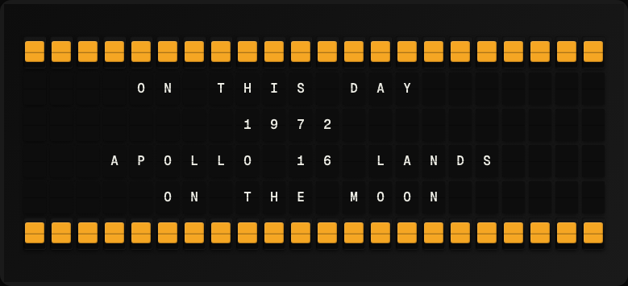

# On This Day Plugin

Display a notable historical event that happened on today's date.



**→ [Setup Guide](./docs/SETUP.md)**

## Overview

The On This Day plugin queries the Wikimedia On-This-Day API to surface a notable historical event that occurred on today's month and day. No API key required.

## Template Variables

| Variable | Description | Example |
|---|---|---|
| `on_this_day.year` | Year the event occurred | `1969` |
| `on_this_day.text` | Short description of the event | `Moon landing` |
| `on_this_day.date` | Today's date (Month Day) | `May 1` |

## Example Templates

```
ON THIS DAY
{{on_this_day.date}}

{{on_this_day.year}}
{{on_this_day.text}}

```

## Configuration

| Setting | Name | Description | Required |
|---|---|---|---|
| `event_index` | Event Position | Which event to display (1 = most notable). | No |

## Features

- Wikimedia On-This-Day API
- Configurable event position
- Daily refresh
- No API key required

## Author

FiestaBoard Team
